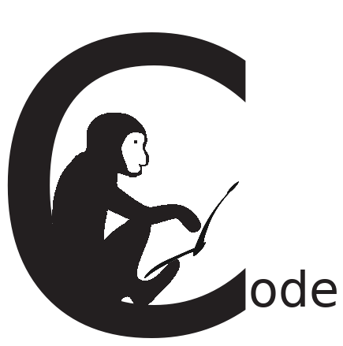

 After creating some code we started today our homepage. It comes as blog and is completly managed via github as we like most of githubs features a lot.

What can you expect here. Beside blog posts to our projects and how to work on it we think we spot on other interesting topics we encouter in our daily work.
