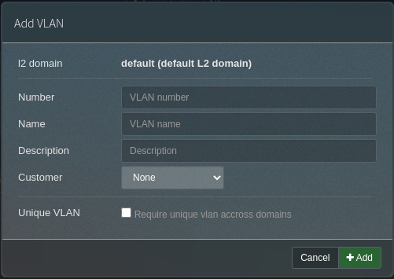

We started to develop our [phpipam-ansible-modules](https://github.com/codeaffen/phpipam-ansible-modules) to manage phpIPAM installation from within Ansible.
We provide half a dozen of modules but unfortunately we currently do not support all controllers.

We want to provide a walkthrough how to to enable you to start with developing of new phpipam ansible modules. We choose the `vlan` controller as a simple example to illustrate which concepts you have to use to develop such a module.

## Starting with API doc

The first starting point should ever be the [phpIPAM API documentation](https://phpipam.net/api/api_documentation/){:target="_blank"}. There you can find available parameters for the controller of choice.

For the `vlan` controller you find there the following parameters. Parameters with `methods` set can be used for manipulating an entity via API. Parameters with methed set to `/` will be only returned by the controller.

|parameter|type|methods|description|
|:--------|:---|:------|:----------|
|**id**|number|GET, PATCH, DELETE|Vlan identifier, identifies which vlan to work on.|
|**domainId**|number|POST, PATCH|L2 domain identifier (default 1 – default domain)|
|**name**|varchar|POST|Vlan name|
|**number**|int|POST, PATCH|Vlan number|
|**description**|text|POST, PATCH|Vlan description|
|**editDate**|datetime|/|Date and time of last update|

You should also look into phpIPAM's WebUI as the API documentation does not say much about mandatory parameters and possibly defaults.

For most controllers `name` is a mandatory parameter, in our case `number` is also required.

In the `Add VLAN` dialog is also defined that `default` is the default L2 Domain.

With all of this information we can define which parameters our module have to take care of. You also have to translate the datatypes to these which ansible supports for [argspec](https://docs.ansible.com/ansible/latest/dev_guide/developing_program_flow_modules.html#argument-spec){:target="_blank"}.

|parameter|type|required|default|
|:--------|:---|:-------|:------|
|**id**|int|||
|**domainId**|int||1|
|**name**|str|*||
|**number**|int|*||
|**description**|str|||

## The minimal amount of code

If you already had developed a ansible module you know that it's starts with an instace of `AnsibleModule`.

We decided to put some common code to a separate class which derives from `AnsibleModule`. This class has to be used for new modules as the base class. This base class is located in `phpipam_helper` module.

~~~python
from ansible_collections.codeaffen.phpipam.plugins.module_utils.phpipam_helper import PhpipamEntityAnsibleModule
~~~

In this base class exists code which decides which controller have to be used based on the class name. The scheme to follow is `Phpipam` + `capitalized(controllername)` + `Module`.

~~~python
class PhpipamVlanModule(PhpipamEntityAnsibleModule):
    pass
~~~

The class does not need any body, a simple `pass` is enough.

### Defining module parameters

Now you need to add the determined API parameters as module parameters.

~~~python
module = PhpipamVlanModule(
    phpipam_spec=dict(
        id=dict(type='int', invisible=True, phpipam_name='vlanId'),
        name=dict(type='str', required=True),
        description=dict(type='str'),
        vlan_id=dict(type='str', required=True, phpipam_name='number'),
        routing_domain=dict(type='entity', controller='l2domains', phpipam_name='domainId', default='default')
    )
)
~~~

#### phpipam_name

You may want to add more user friendly parameter names to your module, so you can facilitate the `phpipam_name` parameter to map the ansible names to the corresponding API names.

#### invisible

The `id` parameter is marked as `invisible` because no one will configure entities by putting an id in but the API uses the `id` to find the correct entity.

#### type entity and controller

phpIPAM uses always ids to link resources. As using ids for linking is not good for humans we decided to implement an autoresolve method so you provide names for such entity links for your users convinience.
To use the autoresolve facility you need to define such parameters of type `entity` and provide the `controller` to use for resolving entities.

### Defining preconditions

If you want to manage preconditions you can add the following snippet.

~~~python
if not module.desired_absent:
    pass
~~~

Within this if-Block you can add all preconditions you need to be satisfied before you run your module.

An example where we use it is the [nameserver module](https://github.com/codeaffen/phpipam-ansible-modules/blob/develop/plugins/modules/nameserver.py#L96-L98){:target="_blank"}

### Connect and run

Now it's time too let the module run. For that you have to use the following code:

~~~python
with module.api_connection():
    module.run()
~~~

This piece of code creates the API connection and let all methods run which are needed to generate the desired entity state.

## Putting all together

As you now have all needed parts its a good time to putting all of these together. See the [minimal code](https://github.com/codeaffen/phpipam-ansible-modules/blob/develop/plugins/modules/vlan.py#L74-L100){:target="_blank"} on github.

There is the import, the class definition and a main function to putting all module work in one callable piece of code. Finally we call these `main` function in the main part.

## What comes next

To create a full documented and tested module you also have to add [Ansible documentation](https://docs.ansible.com/ansible/latest/dev_guide/developing_modules_documenting.html). Here you are invited to have a look to our existing modules on github.

You also have to add tests within the `tests` folder in the repository. Please have also a look for our existing tests.

## Full code

You can find the full code of the [vlan module](https://github.com/codeaffen/phpipam-ansible-modules/blob/develop/plugins/modules/vlan.py){:target="_blank"} on github.
