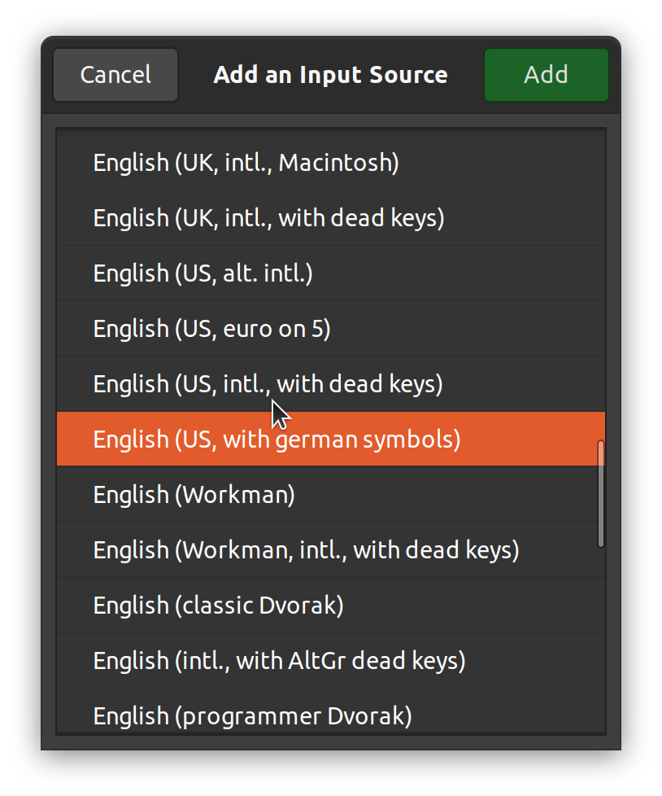

{: .box-warning}
There is a updated version on how to make keyboard layouts available and especially safe against `xkeyboard-config` package upgrades.
Please have a look at [Custom Keyboard Layouts with xkb](../2023-09-16-custom-keyboard-layouts-with-xkb).

As a developer I prefer to use the us intl. keyboard layout as many symboles are positioned better than on the german keyboard layout.
But on the other side I also have to write texts in german and I need to have access to all german umlauts and symboles. Unfortunately there is no layout that suited in all details to my daily needs. Here comes the ability to define a custom keyboard layout in account.

## layout over variant

There are two ways of defining your keyboard arrangement.

* The first one is to define a variant of an existing layout.
* The second one is to define a custom layout with a custom variant.

I personally prefer the second way as I don't need to modify an existing layout file. Which is in my opinion the better way to prevent unwanted switchbacks while updating the layout definition.

## defining a variant

In my case I started to use the variant `alt-intl` for the us intl. keyboard layout. This variant already defines the german umlauts. But it does not define a key combo for e.g. the umlaut ß and also a key combo for the paragraph sign and cent sign was missing.

Let's define a custom layout for the us intl. keyboard layout. Layouts are saved in the `/usr/share/X11/xkb/symbols` directory. Here we create a new file in our case we named it `usde`.

<!-- markdownlint-disable MD033 -->


partial alphanumeric_keys
xkb_symbols "usde" {

   include "us(alt-intl)"

   key <TLDE> { [    grave,    asciitilde,    section,    plusminus    ] };
   key <AC02> { [    s,        S,             ssharp,     U1E9E        ] };
   key <AB03> { [    c,        C,             cent,       copyright    ] };

   include "level3(ralt_switch)"

};


<!-- markdownlint-enable MD033 -->

1. We define our layout within the `xkb_symbols` section.
2. First of all we include the layout `us(alt-intl)` which works well for us so far and we don't want to define all the keys again.
3. We define the tilde key to work as `backtick` and `tilde` (/w shift). In combination with `ralt` we define the `section` key and the `plusminus` key (/w shift).
4. We define the s key to work as `sS` and `ß` and upper umlaut ß (/w shift).
5. We define the c key to work as `cC` and in combination with `ralt` the cent sign and the copyright sign  (/w shift).
6. Last we also include the `level3(ralt_switch)` section which defines the `ralt` key to switch between the `altgr` layer of defined keys.

{: .box-note}
**Note:** You can define the variant also in the symboles file for an existing layout e.g. `us`. But we think that it is better to define the variant in a separate file to be upgrade safe.
{: end-box-note}

## make your variant a layout

To make the recently defined variant a layout we have to define a new layout for xkb. Layouts and variants are defined in the `/usr/share/X11/xkb/rules/evdev.xml` file. You need to add a `<layout></layout>` section within the `<layoutList></layoutList>` block.

<!-- markdownlint-disable MD033 -->


<layout>
  <configItem>
    <name>usde</name>
    <shortDescription>usde</shortDescription>
    <description>English (US, with german symbols)</description>
    <languageList>
      <iso639Id>eng</iso639Id>
    </languageList>
  </configItem>
</layout>


<!-- markdownlint-enable MD033 -->

1. We define a new layout with the name `usde`. The description will be shown in the configuration dialog.
2. We also define a variant with the name `usde`. The description will also be shown in the configuration dialog.
3. Bound the our `usde` layout to all languages with id `eng`. E.g. `English (United Kindom)` or `Englich (United States)`.

{: .box-note}
**Note:** If you decided to define your variant within an existing file you need to create a new variant in the corresponding `<layout></layout>` block, e.g. `us`.
{: end-box-note}

## setup your keyboard

Now you can select your newly defined layout in the configuration dialog.

{: .mx-auto.d-block :}

{: .box-note}
**Note:** It can be necessary to logout and relogin to make the layout available.
{: end-box-note}

From now on you can use all the defined key combos as you would normally do.
