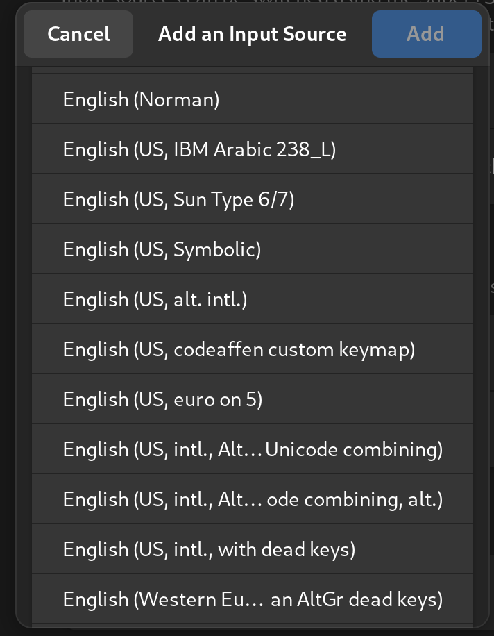

There are different reasons why the definition of custom keyboard layouts can become necessary.

1. A developer prefers to use us intl. Keyboard layout because of the intuitive positioned symbols needed for writing code
2. A writer who is writing texts in more than one language (e.g. English, German, Italian) and doesn’t want to switch between different layout but want able to use all the special characters in each language

There are probably a number of other reasons, but we the examples shown above should be enough.

## xkeyboard configuration

In modern Linux distributions the `xkb` facility is a core component for defining and providing keyboard layouts, variants and many more. This guide will show how to reach the goal of defining a custom layout and make it available in `gnome-settings` app.

### xkb system configuration

The configuration for `xkb` can be found in `/usr/share/X11/xkb`. There are two subdirectories we are interested in.

1. `symbols`, here you find keyboard layout definitions
2. `rules`, provides files for mapping a definition to a configuration

{: .note-warning}
In our former article ([Custom Keyboard Layouts on Ubuntu](../2022-02-07-custom-keyboard-layout)) we did our changes within these directories. This procedure is not that good, as custom changes will be reverted on each `xkeyboard-config` package upgrade.

The following text will focus on how to configure `xkb` with custom keyboard layouts and make them per user or globally available and upgrade safe.

### xkb user configuration

Locating `xkb` configurations is done in `libxkbcommon` and this library walks through a set of directories to find configurations. These search paths make it possible to make configurations either per user or globally available. The following paths will be searched in the given order.

1. `$XDG_CONFIG_HOME/xkb/`, or `$HOME/.config/xkb/` if the `$XDG_CONFIG_HOME` is not defined
2. `$HOME/.xkb/`
3. `$XKB_CONFIG_EXTRA_PATH/xkb` if `$XKB_CONFIG_EXTRA_PATH` is defined, otherwise `<sysconfdir>/xkb` (mostly this is /etc/xkb)
4. `$XKB_CONFIG_ROOT/X11/xkb` if `$XKB_CONFIG_ROOT` is defined, otherwise `<datadir>/X11/xkb/` (mostly this is /usr/share/X11/xkb)

We will show how to create your custom layout with option 1). To make your layout machine globally available, you can create the discussed files and directories in the base mentioned in option 3).

## creating you layout

To cover all the use cases mentioned above, we derive our layout from layout `us` variant `alt-intl` as this combination offers most of the keys a US Intl keyboard has. It also defines the needed German umlauts. But it does not define a key combo for e.g. the umlaut ß and also a key combo for the paragraph sign and cent sign was missing.

We also need a ``` sign to write Italian letters with an accent. To achieve this, we put the backtick as a dead key in our layout.

Create a file in `~/.config/xkb/symbols` (e.g. `codeaffen`).

<!-- markdownlint-disable MD033 -->


partial alphanumeric_keys
xkb_symbols "usde" {

   include "us(alt-intl)"

   key <TLDE> { [ dead_grave, asciitilde, section,    plusminus    ] };
   key <AC02> { [          s,          S,  ssharp,    U1E9E        ] };
   key <AB03> { [          c,          C,    cent,    copyright    ] };

   include "level3(ralt_switch)"

};


<!-- markdownlint-enable MD033 -->

1. We define our layout within the `xkb_symbols` section
2. Foremost, we include the layout `us(alt-intl)` which works well for us so far, and we don’t want to define all the keys again
3. We define the tilde key to work as `backtick` (dead key) and `tilde` (/w shift). In combination with `ralt` we define the `section` key and the `plusminus` key (/w shift)
4. We define the s key to work as `sS` and `ß` and upper umlaut ß (/w shift)
5. We define the c key to work as `cC` and in combination with `ralt` the cent sign and the copyright sign  (/w shift)
6. Last, we also include the `level3(ralt_switch)` section which defines the `ralt` key to switch between the `altgr` layer of defined keys

## adding an option

To make your layout an option, you need to create a `evdev` file in `~/.config/xkb/rules` with the following content.

```evdev
! option   = symbols
  codeaffen:usde  = +codeaffen(usde)

! include %S/evdev
```

1. We work on `option = symbols` section in `evdev` file
2. We define an option in `symbols` section to map `codeaffen:usde` to `usde` section in `symbols/codeaffen`
3. Last, we include the default `evdev` file. If you miss this line it can happen that you can log in in Gnome but the session will crash

## make layout discoverable

To make your layouts discoverable, tools rely on `evdev.xml` file. To add your custom layout, we need to create a `evdev.xml` file in `~/.config/xkb/rules` directory as followed.

<!-- markdownlint-disable MD033 -->


<?xml version="1.0" encoding="UTF-8"?>
<!DOCTYPE xkbConfigRegistry SYSTEM "xkb.dtd">
<xkbConfigRegistry version="1.1">
  <layoutList>
    <layout>
      <configItem>
        <name>codeaffen</name>
        <shortDescription>usde</shortDescription>
        <description>English (US, codeaffen custom keymap)</description>
        <countryList>
          <iso3166Id>US</iso3166Id>
          <iso3166Id>DE</iso3166Id>
        </countryList>
        <languageList>
          <iso639Id>eng</iso639Id>
          <iso639Id>deu</iso639Id>
        </languageList>
      </configItem>
    </layout>
  </layoutList>
</xkbConfigRegistry>


<!-- markdownlint-enable MD033 -->

1. We defined a new layout named `codeaffen`. This will map to the definition file created before
2. We also define a short description `usde`. The short description will be shown in the layout switch tray icon (if more than on layout is configured)
3. The description will be shown in the configuration dialog (e.g. in Gnome, Tray chooser)
4. We bound the layout to all languages with ISO ID `eng` and `deu` as well as countries with ISO ID `US` and `DE`

{:.mx-auto.d-block :}

## set up your keyboard

{: .box-note}
**Note:** It can be necessary to logout and relogin to make the layout available.

Now you can select your newly defined layout in the configuration dialog.

{:.mx-auto.d-block :}

From now on, you can use all the defined key combos as you would normally do.

## last thoughts

### Gnome

To use the `View Keyboard Layout` option in `Gnome` it to get a picture of your desired keyboard layout, you need to make your symbols file also in the system directory available. A symlink is absolutely enough and upgrade safe.

```shell
sudo ln -s ~/.config/xkb/symbols/codeaffen /usr/share/X11/xkb/symbols
```

If the file is not accessible from the system path, you will either get an empty window (Fedora 38) or an error message (e.g. Ubuntu 22.04).

### localectl

An in that way configured custom layout is not accessible for `localectl` as this tool only opens a single file from `/usr/share/X11/xkb/rules`. A [bug report](https://github.com/systemd/systemd/issues/29178){:target="_blank"} was opened in `systemd` project.
